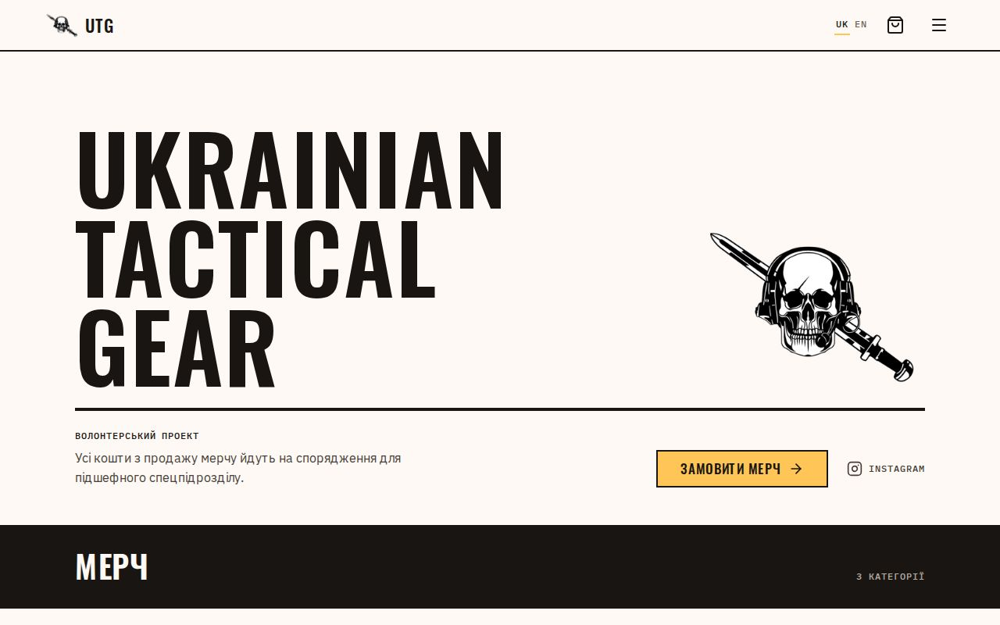
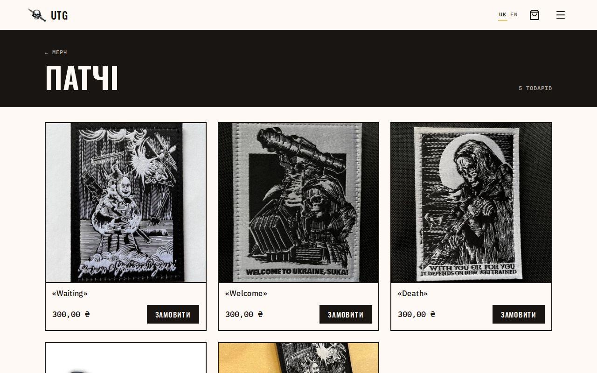
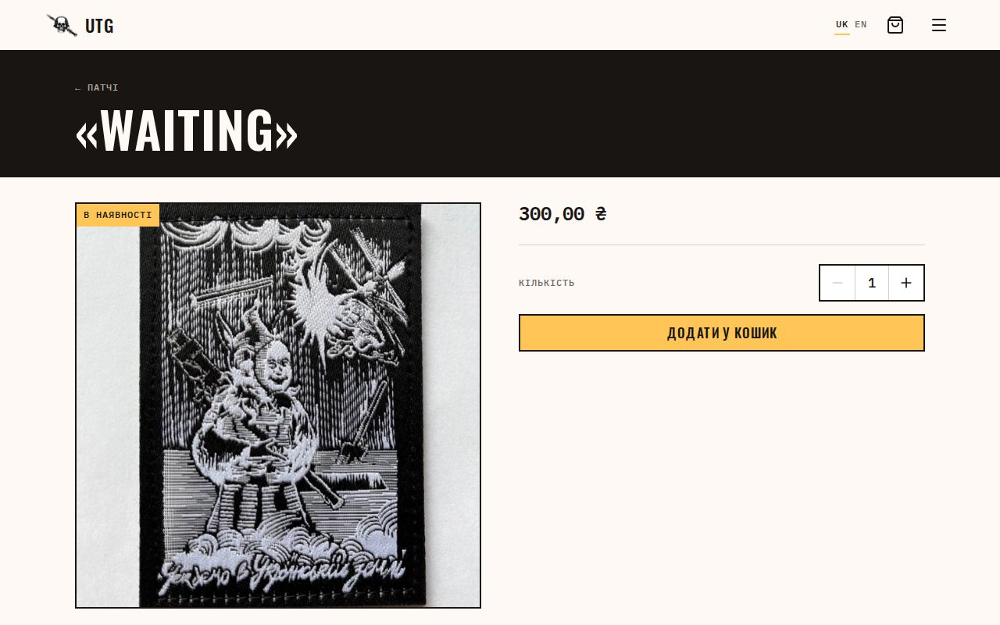
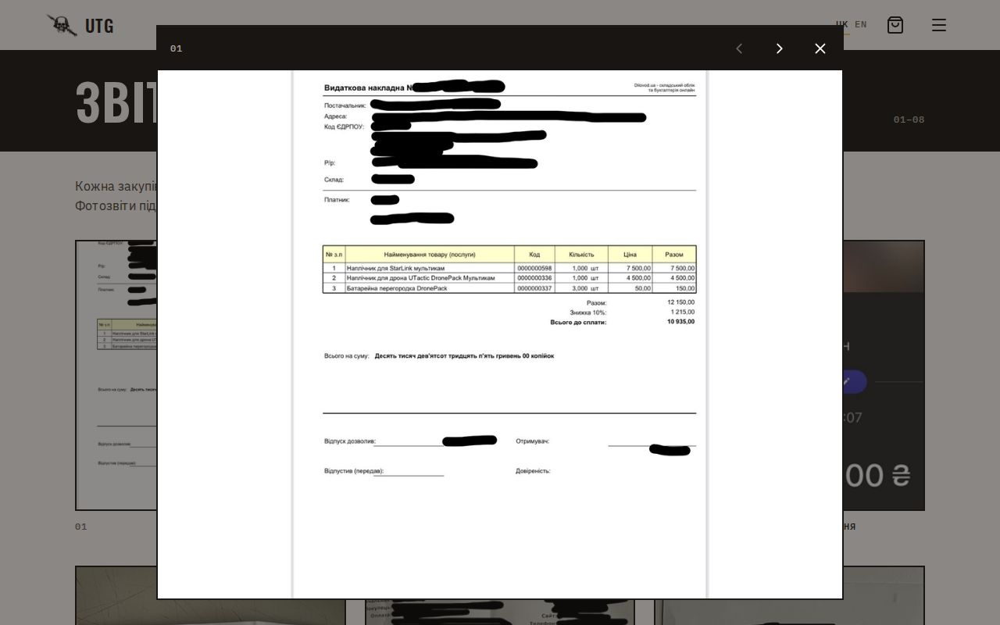
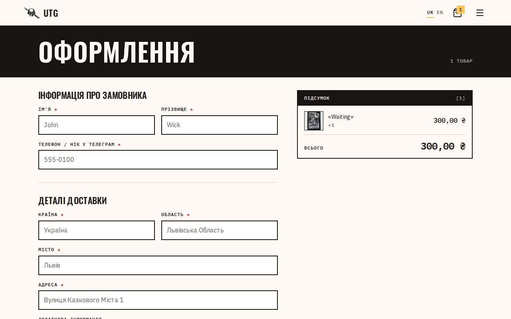
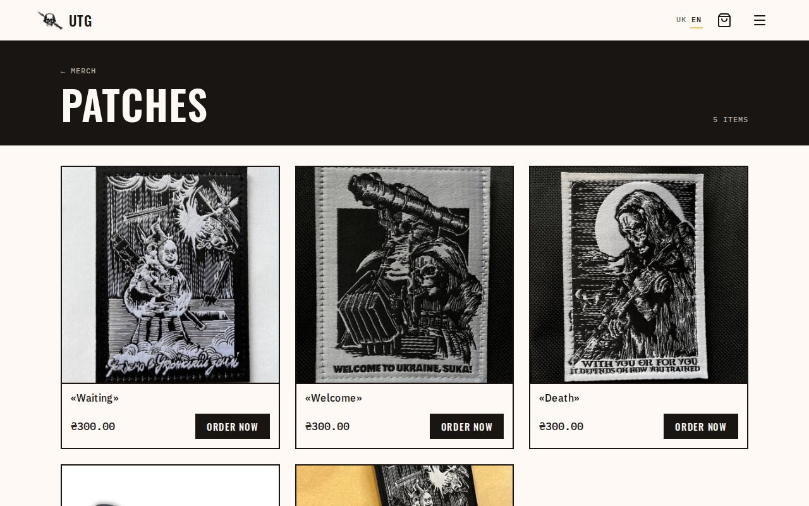
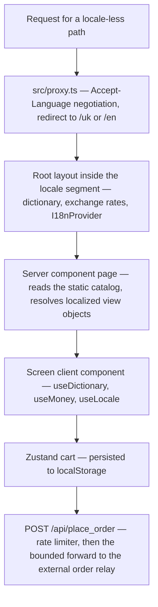

# Ukrainian Tactical Gear

[](https://github.com/maksim-pokhiliy/utg-2.0/actions/workflows/ci.yml)
[](./LICENSE)
[](https://www.ua-tactical-gear.com)

A bilingual merch storefront that funds a Ukrainian military unit. It is live at
**[www.ua-tactical-gear.com](https://www.ua-tactical-gear.com)** and takes real orders, so every commit here has to leave a
working shop behind it.

## Screenshots



|                                                         |                                         |
| ------------------------------------------------------- | --------------------------------------- |
|                  |    |
|  |  |

The same category on the `en` locale, priced in hryvnia:



These are captured by a script, not by hand — `yarn screenshots` builds the app with no environment variables and drives a
headless browser through the six screens above ([`screenshots/capture.spec.ts`](./screenshots/capture.spec.ts)). That is also
why the English shot shows ₴ rather than $: with no exchange-rate key in the environment both locales fall back to the real
UAH amount, because a dollar sign over a hryvnia magnitude would be worse than leaving it unconverted.

## What it is

A volunteer project. It grew out of repeated requests from the community for branded merch and doubles as a way to raise
funds: proceeds go toward equipment, consumables, and repairs for a Ukrainian military unit.

The shop is deliberately small. There is no database, no CMS and no payment provider. The catalog is a typed module compiled
into the app, prices are stored as UAH integers, and checkout hands the finished order to an external relay service the
operator already ran before this site existed. Two locales — `uk` (default) and `en`.

## Stack

|            |                                         | Pinned in                                  |
| ---------- | --------------------------------------- | ------------------------------------------ |
| Next.js    | 16.2.10, App Router                     | `package.json`                             |
| React      | 19                                      | `package.json`                             |
| TypeScript | 5, `strict`                             | `tsconfig.json`                            |
| Tailwind   | 4, CSS-first theme                      | `src/design-system/styles/theme.css`       |
| State      | Zustand plus React context              | `src/store/`, `src/i18n/`                  |
| UI         | in-repo sealed design system on Radix   | `src/design-system/`                       |
| Tests      | Vitest with Testing Library, Playwright | `vitest.config.ts`, `playwright.config.ts` |
| CI         | GitHub Actions, one battery per PR      | `.github/workflows/ci.yml`                 |
| Node       | 24.x                                    | `engines.node` in `package.json`           |

That last row is the only Node pin in the repo, on purpose: Vercel reads `engines.node` and it overrides the dashboard
setting, yarn enforces it on every install, and CI consumes the same value through `node-version-file: package.json`. One
number, three consumers, nothing to drift.

Turbopack is not pinned or configured anywhere here — it is simply the default bundler in Next 16, so it is what `next dev`
and `next build` run.

## Architecture



```
src/
  app/            routes; the root layout lives inside the [lang] segment
  components/     app-land composition (pages/, cart/, checkout/, layout/)
  data/           the typed catalog and its accessors
  design-system/  the only styling authority, one public barrel
  hooks/          the one shared hook, for closing overlays on navigation
  i18n/           dictionary / money / locale context
  store/          two Zustand stores: cart and sidebar
  utils/          locale, money formatting, SEO helpers
tests/            Vitest units
e2e/              Playwright specs
screenshots/      the capture script and its output
initiatives/      the planning trail (see below)
```

### Routing and i18n

There is no `src/app/layout.tsx`. The root layout lives at `src/app/[lang]/layout.tsx`, so every URL is locale-prefixed and
`dynamicParams = false` turns an unknown locale into a 404. `src/proxy.ts` (Next 16's name for middleware) negotiates the
locale for bare paths. Dictionaries are per-locale JSON, loaded server-side and constrained by a `satisfies` guard against the
English shape, so a key missing from the Ukrainian file is a compile error rather than a blank string in production.

### Pages and screens

Catalog routes are server components: they read the catalog synchronously, resolve the locale, and pass flat view objects into
presentational `*Screen` components. The screens are client components and pull locale, dictionary and money from context.
Nothing about the catalog reaches the browser as a fetch waterfall — the product pages are statically generated.

### Money

Prices live in the catalog as UAH integers. The layout resolves `{ coefficient, currency }` per request: with live rates the
`en` locale converts to USD, and without them **both** locales show the real hryvnia amount. The app never prints `$` over a
UAH magnitude — a wrong currency symbol on a donation-adjacent price is worse than an unconverted one.

### The sealed design system

`src/design-system/` is the sole styling authority, and the seal is mechanical rather than a convention people agree to
respect:

- Tailwind's default palette and text scale are **wiped** from the theme, so `bg-zinc-900` or `text-sm` produce no CSS at all.
- ESLint errors on raw colour values, raw text-size utilities, deep imports past the barrel, and raw `<button>` / `<a>` JSX.
  The rule block is scoped to `src/**` and skips the design system itself; `tests/`, `e2e/` and `screenshots/` sit outside
  `src/` deliberately, so the seal never has to argue with a test fixture.
- TypeScript unions on `Typography` variants and `Container` widths make an invalid size a compile error.

There is one more layer, and it is a convention rather than a tool: the repo does not use code comments. Since an
`eslint-disable` is a comment, reaching for the escape hatch reads as an obvious anomaly in review instead of passing
unnoticed. Nothing enforces that automatically — it holds because every diff is read. Today `src/` contains no comments and no
`eslint-disable` directives at all.

App code composes design-system components and semantic token utilities. The composite patterns — `Dialog`, `ConfirmDialog`,
`CategoryTile`, `ProductCard`, `SectionBand`, `CartLine`, `MediaFigure`, `Lightbox` — are exported as closed intent APIs that
take content and state rather than slots, so a call site cannot quietly recompose their internals. The barrel also exports
ordinary primitives to build with: `Typography`, `Container`, `Button`, `IconButton`, `Input`, `Select`, `Skeleton`, the
`Sheet` compound and the rest.

### Orders

`POST /api/place_order` forwards the checkout payload to an external relay and passes the upstream status through; its 500
body carries nothing internal. A per-IP in-memory limiter (5 requests per 60 seconds) runs before the body is even parsed,
and it fails **open** when no client identity is available — a false 429 costs a real volunteer order, which is the worse
outcome. The forward is bounded on both sides. Inbound, an order body past 64 KiB is refused with **413** before anything
leaves the shop — a sixty-line cart weighs about sixteen kilobytes, so the ceiling is generous and still finite. Outbound,
a twenty-second deadline covers the connect and the relay's answering headers, and the shop replies **504** itself rather
than letting the platform kill the request out from under a buyer. The relay's answer body is never read at all: the shop
takes its **status**, drops the rest mid-stream, and replies with its own `application/json` and `nosniff`. Mirroring the
status leaves the verdict on an order where it belongs — with the relay — while the bytes a browser receives stay ours.
The payload field names are a fixed contract with the receiving bot, pinned by a test on this side and by the bot's own
contract test on the other.

### Delivery directory

`GET /api/np/settlements` and `GET /api/np/warehouses` proxy the Нова Пошта address directory, and the Ukrainian
checkout is what consumes them: a method chooser (відділення, поштомат or courier), a settlement box and a warehouse box
filtered to the chosen method. The API key stays server-side and the rows are minimized on the way out — a settlement is
`{ref, label, region?, warehouseCount, isCourierAllowed}`, a warehouse is `{number, label}` — and capped, so a big city's
full branch list never crosses the wire. The last two settlement fields are what lets a screen say honestly which
delivery methods a place actually has: Нова Пошта reports settlements with no pickup points at all, and courier delivery
genuinely is not offered everywhere.

The warehouse search is the carrier's, not ours. We used to page through a whole city and filter the merged list in
process, which cannot work: Київ alone reports over twelve thousand pickup points, so the merge never completed and the
biggest cities silently lost their directory. Now one query goes to the carrier's own search and comes back in a single
page. What stays ours is the policy — the branch/поштомат split, the refusal to offer a point the carrier marks closed or
unselectable, and the row caps. Відділення covers more than a branch: Нова Пошта also runs pickup points and
shop counters that take parcels up to thirty kilos, and a village often has nothing else, so all three sit under that
chip. The freight terminal and the carrier's own fulfilment warehouse are recognised and never offered — neither is a
place a shopper collects a t-shirt from. Every row keeps the carrier's own wording, which is what tells the shopper
which of the three they just picked. Answers are cached in process for five minutes, keyed per settlement query and per
city and query for warehouses — the branch and the поштомат lists come out of one and the same downloaded page, split
when it is read.

Two things bound what that layer can spend. After three consecutive signals that the carrier itself is in distress we
stop calling it for thirty seconds, and no more than twelve calls are ever in flight at once; a call over that ceiling is
refused on the spot rather than queued behind a deadline it would miss anyway. Distress means the carrier's own error
code, not our own bad request: asking about a city that does not exist is answered honestly and never counts toward that
tally, so one malformed query cannot darken the directory for everyone else. And a refusal we invented ourselves is
never remembered as though the carrier had said it.

These routes get their own limiter bucket (60 requests per 60 seconds per server instance) because autocomplete fires far
more often than an order does. Every failure — missing key, timeout, carrier error, a response we cannot decode —
collapses to a single 503, and that is what the checkout keys its fallback on: the affected field turns into a plain text
box with a short hint, keeping whatever was already typed, and the order still goes through. A search that simply finds
nothing is not a failure: it answers 200 with an empty list, because a place with no поштомат is a fact about the place,
not an outage, and the form must not degrade over a fact. A category we have never seen is a fact about the place too, and
is answered the same way; only a page we could not read at all is treated as the carrier changing under us.

Nothing about the delivery block can leave a buyer stuck. If the directory is unreachable the fields are free text; if it
is reachable but has no entry for somewhere real, a hand-typed city or warehouse is still accepted, and the order records
that it was typed rather than chosen so the operator knows to confirm it on the call they already make.

### SEO

The indexable pages — home, catalog, category, product, reports, about — build their metadata through one helper: canonical
URL, `hreflang` for both locales plus `x-default`, and per-page Open Graph. Checkout and the 404 skip that helper and declare
`robots: { index: false }` inline instead. The layout owns the invariants, because a child's `openGraph` replaces the
parent's rather than merging with it. Product pages carry Product JSON-LD whose offers are always in UAH — the operator
charges hryvnia, and the display currency is informational. `sitemap.ts` is generated from the same catalog accessors the
pages use, so a route that exists is a route that gets listed; `robots.ts` is a static rule set. The sitemap is pinned at 38
URLs by both a unit test and an e2e test, so dropping a locale or a product from the routing surface fails CI.

### Data

The catalog is business data recovered from the previous version of the site, not sample content: titles, UAH prices,
availability, sizes and both descriptions per product. Declared image dimensions are drift-guarded byte-for-byte against the
real headers of the JPEGs under `public/images/` and of the PNG logo at `public/logo.png`, so a swapped asset cannot silently
start shipping the wrong `width`/`height`.

## How this repo was built

The most unusual artifact in this repository might not be the storefront. It is
[`initiatives/`](./initiatives/README.md) — the complete, unedited planning trail of the work, kept in git on purpose.

The project runs on a **planner/executor split**. A planner session owns the initiative directory: it writes the charter,
ratifies decisions, issues one scoped prompt per step, reviews the executor's plan before any code is written, and reviews the
resulting pull request. Executor sessions each take a single `step-*-prompt.md` file, run it end to end, and open one PR
against `master`. Executors read the initiative files freely and never edit them.

Each initiative keeps a fixed set of files:

- [`charter.md`](./initiatives/production-polish/charter.md) — goal, scope, non-goals, acceptance criteria, and the
  constraints that are not up for negotiation (the shop takes real orders; the order payload and the catalog data are sacred).
- [`plan.md`](./initiatives/production-polish/plan.md) — the phased steps.
- [`state.md`](./initiatives/production-polish/state.md) — the board: status per step, plus the single concrete next action.
  This is the resume entry point.
- [`decisions.md`](./initiatives/production-polish/decisions.md) — numbered decisions, each with its rationale and status.
  Why the design system is sealed, why Node is pinned exactly once, why this trail is public at all — all written when the
  call was made rather than reconstructed afterwards.
- [`deferred.md`](./initiatives/production-polish/deferred.md) — a numbered ledger of findings and follow-ups, each with a
  disposition and a status. Things that were spotted and consciously not done yet live here instead of evaporating.
- [`journal.md`](./initiatives/production-polish/journal.md) — append-only narrative, one entry per session, including the
  rounds that went wrong and the planner's own corrections.

The rule that holds it together is that nothing load-bearing is allowed to stay only in a chat window: every ratified
decision, every carry-forward and every board change is promoted into these files at the end of the session that produced it.
The step prompts are committed too, so any claim in this README can be read against the instruction that produced the code and
the review that accepted it.

## Getting started

Node 24.x and Yarn. The Node major is enforced at install time, so a mismatched local version fails loudly instead of
producing a build that only breaks in production.

```bash
yarn install
yarn dev
```

Open [http://localhost:3000](http://localhost:3000) — you will be redirected to `/uk` or `/en` based on your browser language.

**No environment variables are required.** The app boots, builds and passes its whole test suite with an empty environment:
the catalog is static, and the exchange-rate fetch is guarded so prices fall back to hryvnia. The five optional keys in
`.env.example` only add capability on top:

| Variable                | Without it                                                    |
| ----------------------- | ------------------------------------------------------------- |
| `EXCHANGE_RATE_API_URL` | `en` prices stay in UAH                                       |
| `EXCHANGE_RATE_API_KEY` | `en` prices stay in UAH                                       |
| `PLACE_ORDER_URL`       | checkout answers 503 and the cart is preserved                |
| `NOVA_POSHTA_API_KEY`   | uk checkout falls back to free-text city and warehouse fields |
| `ORDER_RELAY_SECRET`    | orders go to the relay unauthenticated                        |

### Scripts

| Command                         | What it does                                                 |
| ------------------------------- | ------------------------------------------------------------ |
| `yarn dev`                      | Dev server on http://localhost:3000                          |
| `yarn build`                    | Production build                                             |
| `yarn start`                    | Serve the production build                                   |
| `yarn lint` / `yarn lint:fix`   | ESLint, including the design-system seal rules               |
| `yarn format`                   | Prettier over the repo                                       |
| `yarn typecheck`                | Both TypeScript programs — the app, and tests plus tooling   |
| `yarn test` / `yarn test:watch` | Vitest units                                                 |
| `yarn e2e`                      | Zero-environment build, then Playwright against `next start` |
| `yarn screenshots`              | Regenerate the README screenshots                            |

## Tests and CI

One job runs on every pull request and every push to `master`: install, lint, `prettier --check`, typecheck of both TS
programs, Vitest, a build with the five environment keys explicitly blanked, and the Playwright suite. It needs no secrets,
which means a fork's pull request gets exactly the same signal as a branch.

The suite is shaped around contracts rather than a coverage percentage. The order payload is pinned against the receiving
bot's own source. Declared image dimensions are checked against real file headers. The sitemap count is pinned. The e2e run
builds with a blank environment on purpose, so checkout's real 503 becomes a deterministic fixture and the suite can never
reach the live relay or flake on live exchange rates.

## License

The code in this repository is MIT-licensed — see [LICENSE](./LICENSE).

This does **not** cover the content. Product artwork, photographs, the photo reports, the logo and the Ukrainian Tactical Gear
name belong to the unit and are included here only so the site can run. The recovered sources kept under
`initiatives/production-polish/extracted/` are documentary and are not licensed either. [NOTICE](./NOTICE) spells all of that
out. Reuse the code, not the brand.
